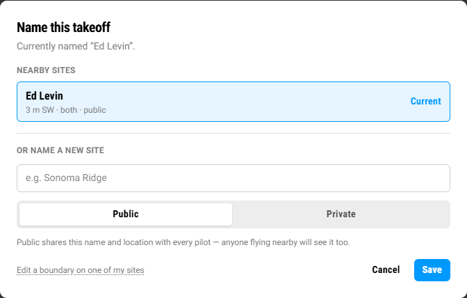
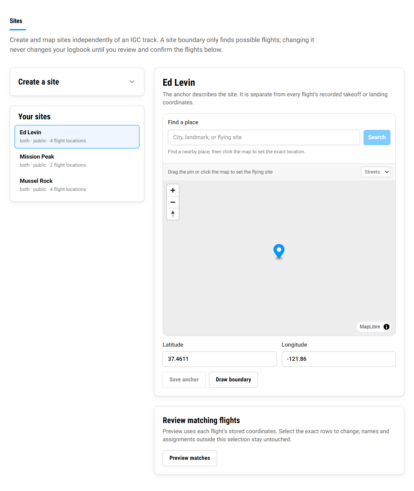
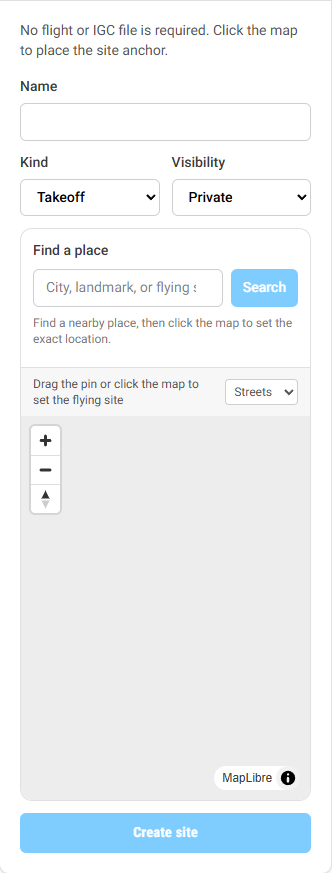
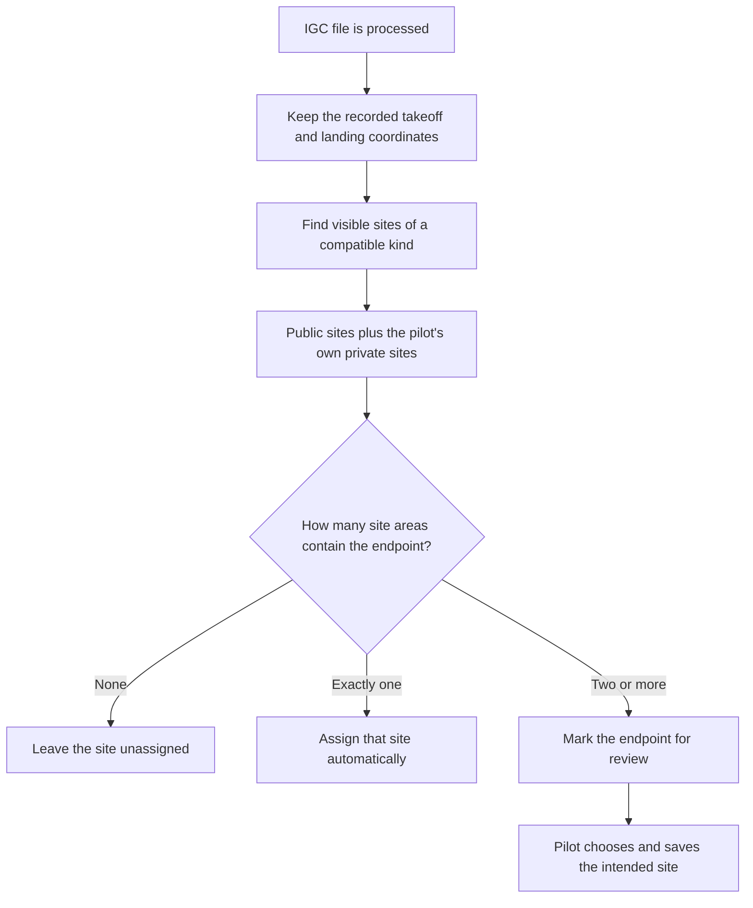
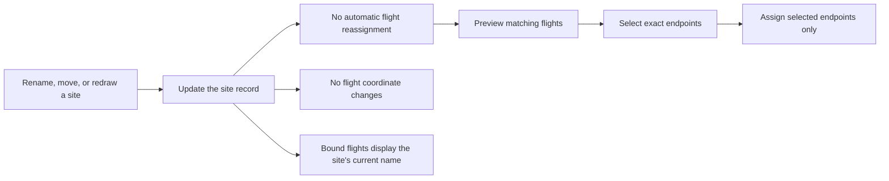
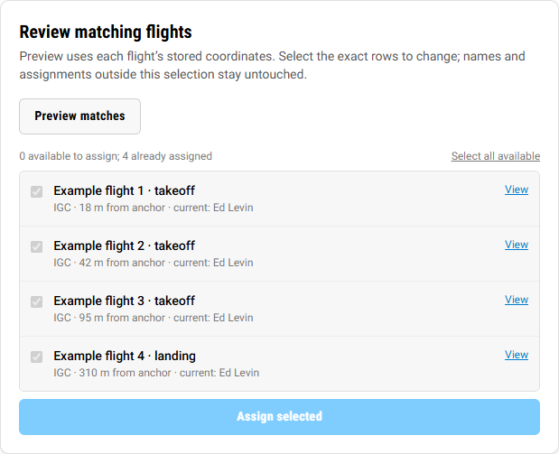

# LeafLog sites

Sites give a familiar name to a takeoff or landing area. They are reusable places, separate from the GPS coordinates recorded for any one flight.

This distinction is the most important thing to remember:

- A **site** has a name, an anchor point, a kind, a visibility setting, and optionally a boundary.
- A **flight** keeps its own takeoff and landing coordinates.
- Assigning a flight to a site links the two; it does not replace the flight's recorded coordinates.

## Contents

- [The three location concepts](#the-three-location-concepts)
- [Public and private sites](#public-and-private-sites)
- [Avoiding duplicate sites](#avoiding-duplicate-sites)
- [Creating a site without an IGC file](#creating-a-site-without-an-igc-file)
- [Creating or changing a site from a flight](#creating-or-changing-a-site-from-a-flight)
- [CSV and manually entered flights](#csv-and-manually-entered-flights)
- [Automatic IGC site detection](#automatic-igc-site-detection)
- [Overlapping sites](#overlapping-sites)
- [What changes affect existing flights?](#what-changes-affect-existing-flights)
- [Recommended workflow](#recommended-workflow)

## The three location concepts

| Concept | What it means | What changing it does |
| --- | --- | --- |
| Flight endpoint | The takeoff or landing latitude/longitude recorded for one flight, usually from its IGC track or a CSV/manual entry | Changes only that flight's location data |
| Site anchor | The representative point for a reusable site | Moves the site's reference point; does not move any flight endpoints |
| Site boundary | A custom shape defining where that site may match a flight endpoint | Changes future matching and previews; does not automatically reassign flights |

Without a custom boundary, LeafLog uses a circle around the site anchor: **600 m for takeoffs** and **900 m for landings**. Once a boundary is drawn, the boundary replaces that default circle for matching.

The site anchor does not have to be the first point in an IGC file. This is useful when a logger acquired its GPS fix late. Move the site anchor to the real launch location, then draw the boundary around the area that should count as the site. A saved boundary must contain its site's anchor.

## Public and private sites

| | Public site | Private site |
| --- | --- | --- |
| Who can discover it? | Every pilot | Only its owner |
| Whose uploads can match it? | Any pilot's | Its owner's only |
| Who sees its name and location? | Everyone | Only its owner; other viewers see an unknown site |
| Best for | Established launches and landings that the community should reuse | Personal, sensitive, temporary, or not-yet-ready locations |

Choose **Public** when the place is a real shared launch or landing and you are confident that a public version does not already exist. Choose **Private** when the location should remain personal or when you want to verify it before sharing it.

Public sites are shared records. Renaming a public site changes the displayed name wherever that same site record is used. It does not change flight GPS coordinates or silently attach new flights.

## Avoiding duplicate sites

Before creating a site, look for an existing public one near the flight location. The flight site chooser shows public sites and your own private sites within the nearby search area, including sites whose drawn boundary contains the flight point.

Use this order:

1. Open the site chooser for a flight, or the known-site selector for a manual/CSV entry.
2. Compare the nearby site's name, distance, kind, and visibility.
3. Select **Use this site** when it represents the same real-world place.
4. Create a new site only when the launch or landing is genuinely distinct.

LeafLog also rejects creation of the same normalized site name near a public site or one of your private sites and asks you to reuse the existing record. That protects against obvious duplicates, but differently spelled names can still describe the same place, so the nearby list remains the best check.

> **Note:** **Your sites** on the Sites settings page lists sites you own. It is not a directory of every public site. Use a flight or entry's site chooser to see public candidates near that location.

## Creating a site without an IGC file

Go to **Settings → Sites** and expand **Create a site**. No flight or IGC file is required.

Enter:

- **Name:** a clear, commonly recognized name.
- **Kind:** Takeoff, Landing, or Both.
- **Visibility:** Public or Private.
- **Anchor:** search for a nearby place, then click the map at the representative location.

After creation, select the site under **Your sites**. You can then:

- drag or enter a more accurate anchor;
- draw a boundary;
- preview which of your existing flight endpoints fall inside the boundary or matching radius; and
- explicitly select the endpoints you want to assign.

If an existing boundary prevents moving the anchor to the correct place, remove the boundary, save the new anchor, and then redraw the boundary around it.

## Creating or changing a site from a flight

On a flight page, click the takeoff or landing site name. A bound flight first shows the site's overview. Choose **Choose a different site** to see nearby reusable sites or create a new one.

For a new site created from an IGC flight, LeafLog uses that flight endpoint as the initial anchor. If the recorded start is late or inaccurate, create the site and then move its anchor under **Settings → Sites**. The flight's original endpoint remains where the IGC recorded it.

Selecting **Use this site** is only a selection. Press **Save** to confirm the assignment.

## CSV and manually entered flights

CSV and manual flights do not need an IGC track to use sites.

During CSV import, LeafLog groups imported takeoff and landing names for review. For each name you can either:

- keep the name and coordinates from the CSV as a custom location; or
- map that name to a known public site or one of your private sites.

When the CSV already contains latitude/longitude values, choosing a site keeps those original coordinates and adds the site assignment. When coordinates are missing, selecting a known site can supply the site's anchor as the location.

For an individual manual or CSV-imported flight, use the flight's site control to select a different existing site. If the flight has no usable endpoint coordinate and you need a new site, create it first under **Settings → Sites**, then return to the flight and select it.

## Automatic IGC site detection

Automatic uploads and manually uploaded IGC files use the same location-matching rules. Takeoff and landing are evaluated independently.

For each endpoint, LeafLog:

1. derives and stores the flight's GPS coordinate;
2. considers public sites plus private sites owned by that pilot;
3. filters sites by kind—Takeoff, Landing, or Both;
4. tests the point against each site's custom boundary, or its default radius when no boundary exists; and
5. assigns only a single unambiguous match.

An automatically matched site is a link to the site record. The recorded IGC coordinate remains intact.

## Overlapping sites

Nearby launches and generous error boundaries can overlap. When two or more distinct sites match the same endpoint, LeafLog does not guess based on name or nearest anchor. It marks the location as needing review and presents the possible sites to the flight owner.

The pilot's explicit choice wins. This makes wide boundaries safe for late GPS fixes without allowing one nearby launch to silently absorb another launch's flights.

## What changes affect existing flights?

Site records are shared by every flight assigned to them, but flight coordinates remain independent.

| Action | Result |
| --- | --- |
| Rename a site | Every flight already linked to that site displays the new shared name |
| Move a site anchor | Changes the site's reference location and matching area; flight coordinates stay unchanged |
| Draw or edit a boundary | Changes matching and preview results; no flights are reassigned automatically |
| Choose a different site on one flight | Changes only that flight endpoint's assignment |
| Preview matching flights | Read-only; shows possible endpoints using their stored coordinates |
| Assign selected matches | Changes only the checked flight endpoints |

This means a site edit can “ripple” visually only when several flights already reference the same site record—for example, a rename changes the shared label on all of them. It must not rewrite their recorded GPS points or automatically pull other flights into the site.

## Recommended workflow

For the cleanest logbook:

1. Reuse an existing public site when it represents the same real-world place.
2. Create a private site while location or naming details are uncertain.
3. Set an accurate anchor and draw a boundary only as wide as necessary for normal GPS error or delayed fixes.
4. Preview matching flights after changing geometry.
5. Review every proposed endpoint and assign only the intended rows.
6. Resolve overlapping matches from each flight's **Choose site** prompt.

Following this workflow keeps community locations reusable while preserving the original location evidence attached to every flight.
