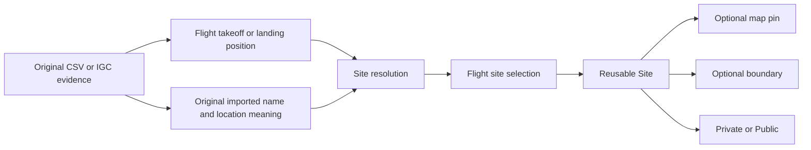
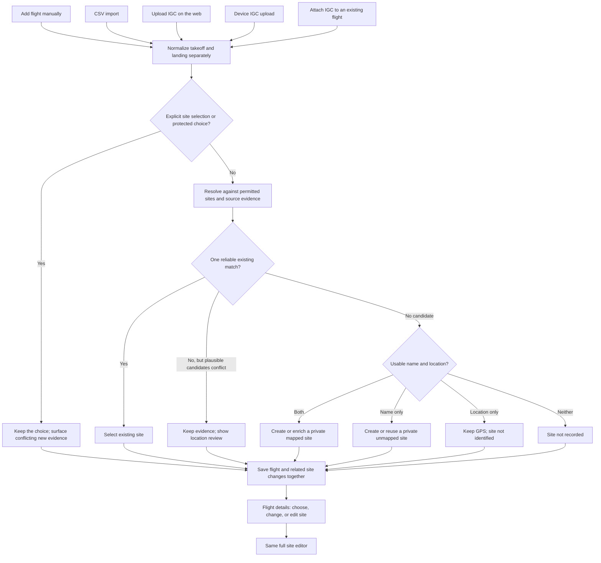
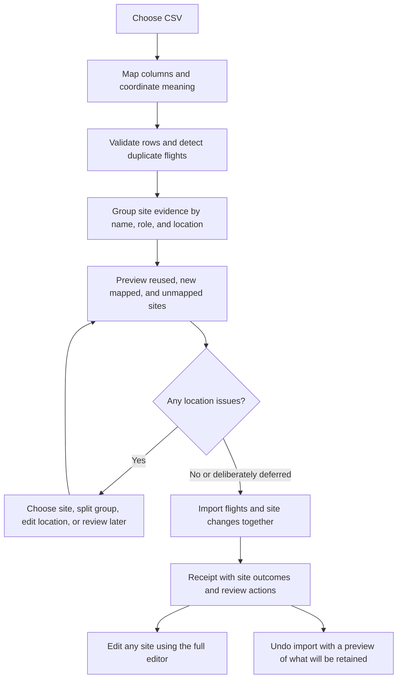
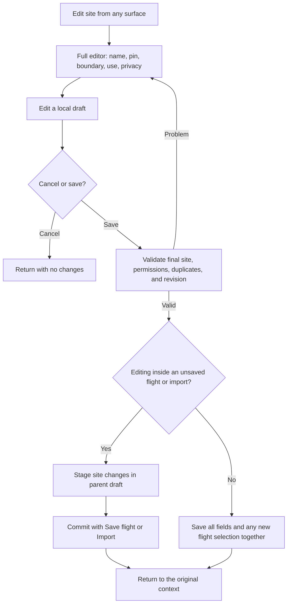
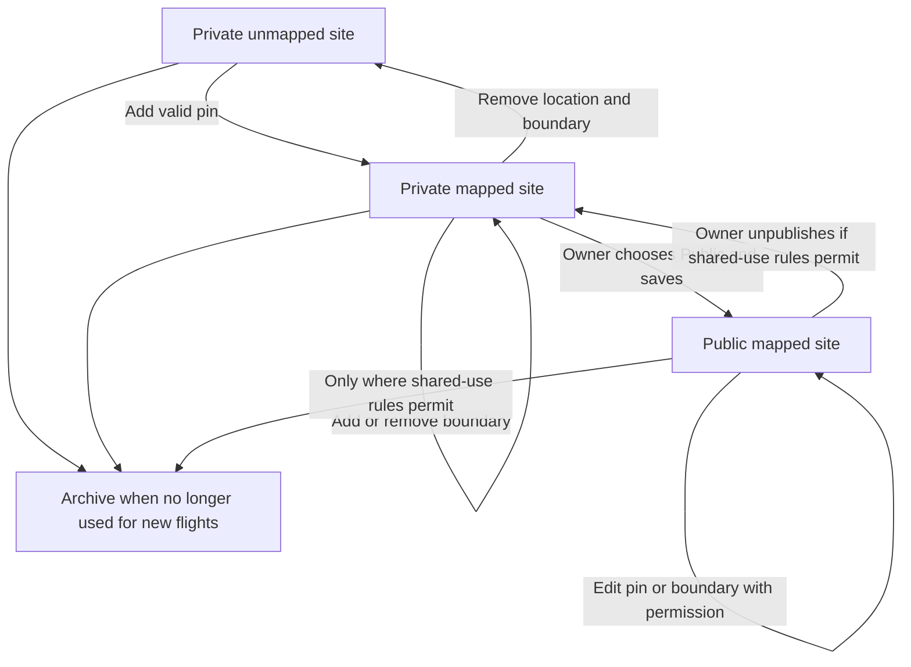

# A consistent site model for Leaf Log

**Status:** Architecture accepted for implementation. The first implementation is documented in [implementation and rollout](unified-sites-implementation.md); the full proposal includes later follow-up work.

**Date:** September 13, 2026

## 1. Recommendation

Treat every named place as a reusable **Site**, whether or not it already has a map location. Give every site the same editor. Adding a pin enriches that existing site; it never requires creating a replacement and returning to the flight to select it.

Use **Mapped site** for a site with a name and a valid map pin. A boundary is optional. Use **Unmapped site** for a named site whose map location has not been established. Within that category, show **Name only** only when there is literally no usable geographic information. If flight coordinates exist but their relationship to the site is uncertain, show **Location needs review** instead.

This small distinction prevents the current mistake from returning: an import with GPS information must never be presented as if it contained only a name.

I recommend these names over “Rich site” or “Leaf Log site.” “Mapped” says exactly what additional information exists. “Rich” does not define a capability, and every site in this product is already a Leaf Log site.

The normal experience should be:

> Enter or import a name and coordinates → Leaf Log reuses an appropriate existing site or creates a private mapped site → Edit site opens the complete editor → Save returns to the flight with the site already selected.

Exceptional or contradictory data should produce a specific review message, not a different editor.

## 2. What the current implementation explains

The following are findings from the local code, not a production database audit:

| Current behavior | Consequence |
| --- | --- |
| A `Site` requires latitude and longitude, but flight names can exist without a `Site` record. | Text-only sites live in a different storage model and follow different editing paths. |
| The display helper checks only site ID and name to choose “Linked site” or “Name only.” | A flight with imported coordinates can be incorrectly described as name only. |
| The flight site editor renders its boundary tools only when a site ID exists. | Editing a saved name cannot become a full site in place. |
| Manual/CSV location handling selects existing sites but does not automatically create sites from names plus coordinates. | Useful imported information remains disconnected from reusable site management. |
| Selecting a site can fill missing flight coordinates with its pin; editing a coordinate can clear the selected site. | A representative location can become indistinguishable from flight data, and editing one fact changes another unexpectedly. |
| A single visible Save currently commits boundary changes before saving the name. | A later failure can leave only part of the edit saved. |
| IGC ingestion already uses one matching service for web uploads and device pushes, and avoids choosing between multiple matching sites. | Preserve that conservative behavior and extend the common pipeline to other entry paths. |
| There are existing public-site community edits, import undo, creation limits, and hidden zone support. | The architecture must account for these rather than treating this as a vocabulary-only change. |

Primary references:

- [Site and flight schema](C:/Users/oxoth/projects/leaf-log/prisma/schema.prisma)
- [Current site labels](C:/Users/oxoth/projects/leaf-log/lib/sites/display.ts)
- [Flight site editor](C:/Users/oxoth/projects/leaf-log/components/flight/name-site-dialog.tsx)
- [Manual/CSV location handling](C:/Users/oxoth/projects/leaf-log/lib/logbook/locations.ts)
- [Manual entry controls](C:/Users/oxoth/projects/leaf-log/components/logbook/entry-fields.tsx)
- [Site detection](C:/Users/oxoth/projects/leaf-log/lib/sites/lookup.ts)
- [Import and undo](C:/Users/oxoth/projects/leaf-log/lib/logbook/service.ts)
- [IGC attachment](C:/Users/oxoth/projects/leaf-log/lib/logbook/attach-igc.ts)
- [Current site guide](C:/Users/oxoth/projects/leaf-log/docs/guides/LeafLog-Sites.md)

## 3. The complete vocabulary

### 3.1 Site location states

There is one Site entity with two location states, rather than separate classes with different tools.

| State | Definition | User-facing description | Editor |
| --- | --- | --- | --- |
| **Mapped** | A name and valid representative map pin; optional boundary. | “Mapped site.” Show “Boundary added” only where useful. | Full editor. |
| **Unmapped** | A name with no established representative map pin. | “Name only” when geographic information is absent; “Location needs review” when evidence exists but is unresolved. | The same full editor, with an empty map or clearly labeled suggested location. |

“Name only” describes missing information. It is not a lesser kind of account, a disabled feature set, or a permanent classification.

An automatically imported pin counts as mapped without requiring an approval ceremony. Its origin remains visible as “Pin from CSV” or “Pin from flight GPS.” Mapped does not imply that the location was surveyed or endorsed.

### 3.2 Properties that must stay separate

| Property | Supported values | Meaning |
| --- | --- | --- |
| **Visibility** | Private; Public | Who can discover and reuse the site. |
| **Used for** | Takeoff; Landing; Takeoff and landing | Which flight endpoint roles the site normally serves. |
| **Boundary** | None; Added | Optional geographic area used for matching. |
| **Location origin** | Set by you; CSV; Flight GPS; Existing catalogue; Legacy origin unknown | Where the current pin came from. Usually shown under details. |
| **Review status** | No action needed; Location needs review | An actionable uncertainty about location or identity. Not a new site type. |

Supported combinations are **private unmapped**, **private mapped**, and **public mapped** sites. Do not introduce public unmapped sites: public discovery needs a recognizable geographic place. The editor shows the Public option with “Add a map pin before sharing this site” when necessary.

A pin with a boundary remains a mapped site. A takeoff and a landing remain uses of a site. Do not add “rich,” “linked,” “CSV,” “IGC,” “community,” or “boundary site” as competing completeness categories.

Keep the existing zones feature outside this redesign's normal user experience. Existing stored zone references must survive, but do not introduce another site/spot hierarchy as part of solving this problem.

### 3.3 Flight states that are not site types

Evaluate takeoff and landing independently.

| Flight endpoint state | What the owner sees | Available action |
| --- | --- | --- |
| Mapped site selected, flight point known | Site name; site pin and flight position distinguishable on the map. | Edit site; Change site; inspect flight location. |
| Mapped site selected, flight point absent | Site name; “Takeoff position not recorded” or equivalent for landing. | Edit site; Change site; enter flight position if appropriate. |
| Unmapped site, no geographic information | Site name; “Name only.” | Edit site, with all map tools available. |
| Named location with conflicting evidence | Site name; “Location needs review,” with a concrete reason. | Review location, using the same chooser/editor. |
| Coordinates but no site name/selection | “Site not identified · GPS available.” | Choose site; enter a name and create a site at that position. |
| No name, coordinates, or selection | “Site not recorded.” | Choose site; Create site. |
| Site unavailable to the viewer | “Site unavailable” for an authorized owner with a broken reference; a neutral hidden-site display for other viewers. | Owner can choose a replacement; hidden details are not revealed. |

Do not create artificial names such as “Unknown,” “GPS site 27,” or a city name guessed from the coordinates just to fill a site field.

## 4. The information model

### 4.1 Three separate facts

1. **A site describes a reusable place.** It has an identity, name, optional pin, optional boundary, visibility, and permitted uses.
2. **A flight has location evidence.** Its takeoff/landing coordinates may be recorded, imported, manually entered, absent, or uncertain.
3. **A flight uses a site.** The selection records which place the pilot or resolver associates with that endpoint.

Selecting or moving a site's pin must not write a flight's recorded position. A map can show the site pin when the flight has no coordinates, but it must label it “Site location; flight position not recorded.”

This is particularly important for CSV import. A column called “Takeoff latitude” describes a flight observation. A column called “Site latitude” may describe a representative site location. Both can create a site pin, but the latter must not be presented as a recorded takeoff. Import mapping should identify the meaning once per column pair. Generic latitude/longitude columns need an explicit interpretation in the import review or a known source-format mapping; uncertain meaning stays labeled as such.

### 4.2 Proposed storage changes

Retain the current Flight takeoff/landing structure for this work; a separate endpoint table is unnecessary to deliver the product behavior.

| Record | Proposed responsibility |
| --- | --- |
| **Site** | Stable ID; display and normalized names; nullable pin; boundary; usage; visibility; owner; location origin; revision; archive/merge state. Derive mapped/unmapped from a valid pin rather than maintaining a competing type flag. |
| **Flight endpoint fields** | Site ID; current flight position; position meaning/source; original imported name; original location evidence; assignment origin; review reason; explicit-choice protection. |
| **Site aliases** | Alternate names confirmed for that site, with owner/import-source scope where appropriate. A pilot's private spelling must not automatically become a public alias. |
| **Import receipt/operations** | Which flights and sites the batch created, reused, or enriched; before/after revisions; enough information for retries and safe undo. |
| **Private operation history** | Minimal revision and reversal data for migration, import, and user correction. This must be separate from the existing public contribution history. |

Preserve immutable original observations when a manual correction or IGC attachment changes the current flight position. Do not reuse a public display-name cache as the sole copy of historical input.

Database and service invariants:

- Site latitude and longitude are both present or both absent; present values must be finite and valid.
- A boundary requires a pin; the final saved boundary contains that pin.
- Public sites require a valid pin. All automatically created sites explicitly default to private.
- A named endpoint created through the new flow references a Site, including an unmapped Site.
- A nameless, unmatched GPS endpoint can legitimately have no Site ID.
- Original observations remain separate from normalized display values and public caches.
- Explicit selections, deliberate removal of a selection, and confirmed mappings survive unattended reprocessing.
- Every read and write checks visibility and ownership; a client-provided site ID is not authority.

## 5. One shared creation and resolution pipeline

All creation paths produce the same endpoint input: name, coordinates and their meaning, role, explicit site selection, owner, and evidence source.

For interactive creation, proposed results appear before Save/Import. For unattended device ingestion, save useful flight data immediately and present unresolved site choices in the logbook afterward. Site uncertainty must not make an otherwise valid flight disappear.

### 5.1 Decision order

1. **Honor an explicit choice.** Revalidate access. If new evidence is outside the site's area, retain the choice and show the discrepancy. If the selection became inaccessible before saving, return a clear recoverable error for interactive saves; unattended jobs retain evidence for review.
2. **Apply an explicitly confirmed mapping** only within its scope: owner, import source, role, and geographic context. A previous choice for one “North Launch” is not a worldwide rule.
3. **Find compatible visible mapped sites.** Public sites and the owner's private sites are eligible. Hidden private sites must not affect suggestions, duplicate messages, or matching results.
4. **Choose only an unambiguous supported match.** Without a supplied name, one matching geographic site can be assigned. With a supplied name, automatic reuse additionally needs a matching normalized name or confirmed alias. Different names at a nearby position are suggestions for review, not silent renames.
5. **Create or enrich when there is sufficient information and no unresolved duplicate.** A usable name plus credible location creates a private mapped site. An explicitly selected unmapped site can be enriched in place if its evidence is consistent.
6. **Preserve incomplete or conflicting information.** Names without geographic evidence become unmapped sites. Coordinates without a name remain flight data. Conflicts receive a reason and candidates.

Pure spelling similarity and nearest-distance ranking help order suggestions; neither establishes site identity. Multiple plausible sites require review unless the pilot has already resolved that exact context.

### 5.2 Geographic matching

Preserve the existing rule initially: a custom boundary replaces the normal search circle; without a boundary, the current radii are 600 m for takeoff and 900 m for landing. These are existing application defaults, not validated claims about GPS accuracy.

Show the matching area in the editor and label it “Used to suggest sites for future flights.” When boundaries overlap, explain “More than one site covers this position.” Moving a pin or boundary changes future proposals, not existing selections.

Import grouping must be stricter than these broad matching circles. A 600 m circle is not proof that every same-named launch inside it is one place. Proposed starting limits for an otherwise unanchored import cluster are a maximum diameter of 150 m for takeoff and 300 m for landing. Validate these defaults against representative logbooks before implementation is enabled. Larger or unclear spreads become reviewable groups; never average distant clusters or use chaining that joins two distant places through intermediate points.

An automatically seeded site with contradictory evidence stays out of unattended geometry-only matching until resolved. A normal coherent imported site can immediately match its owner's later flights. It remains private.

### 5.3 Site identity and repeated names

- Names are not globally unique. “North Launch” in two regions must remain two sites.
- Within a new CSV, coherent same-name coordinate groups can share a single site; takeoff and landing groups combine only with evidence or an explicit choice that they are the same place.
- Coordinate-free rows with the same normalized name can share an unmapped record within that import. This groups a label without inventing a geographic location.
- Do not automatically attach older coordinate-free flights to a newly mapped site just because the names match. Offer a preview of those flights.
- Coordinate-free rows may join a mapped group through an explicit import mapping or a previously confirmed mapping. They still have no recorded flight position.
- Across imports, reuse established site IDs or confirmed mappings. Ambiguous same-name unmapped records are shown as candidates; do not create an unlimited stream of indistinguishable duplicates.
- Adding coordinates to an explicitly selected unmapped site upgrades its existing ID. If its associated flights indicate different places, split only the selected coherent subset into another site after review.

## 6. Behavior for every entry pathway

| Pathway | Default site outcome | What the user can change |
| --- | --- | --- |
| Manual flight, existing site selected | Use that site; leave absent flight coordinates absent. | Change site, or open the full editor immediately. |
| Manual flight, new name only | Save a private unmapped site and select it. | Add a pin/boundary in the same editor now or later. |
| Manual flight, new name plus map location | Reuse an appropriate site or create a private mapped site. | Refine the pin, add boundary, choose visibility. |
| Manual flight, coordinates only | Match one clear existing site, otherwise keep the position unnamed. | Choose an existing site or enter a name to create one. |
| Manual flight, no location data | Save the flight with site not recorded. | Add the site later without recreating the flight. |
| CSV, names and coordinates | Resolve by geographic group; reuse or create private mapped sites at commit. | Edit proposed sites or change a group's mapping in the import review. |
| CSV, names only | Private unmapped sites unless the user maps rows to an existing site. | Full editor directly from the review row. |
| CSV, coordinates only | Match if unambiguous; otherwise GPS remains available without an invented name. | Choose/name the site before import or later. |
| CSV, mixed/missing/conflicting information | Keep per-row evidence; separate geographically distinct groups and flag unresolved rows. | Resolve selected groups; skip invalid data explicitly or defer identity review. |
| Web IGC upload | Match both endpoints independently using recorded points; unknown sites remain GPS-only. | Review candidates or create/edit a site from the resulting flight. |
| Device IGC upload | Same resolution rules; no interactive blocking step. | Resolve later from the logbook/flight. |
| IGC without usable GPS/analysis | Preserve the uploaded file and its processing status; do not invent endpoint locations or sites. | Retry processing or enter/select a site where the flight workflow permits it. |
| Attach IGC to a manual/CSV flight | Keep flight ID and explicit site choices; show the recording comparison; enrich an unmapped site only when safe. | Resolve conflicts and accept recording data in one reviewed operation. |
| Edit an existing flight's position | Change that flight's position/provenance; keep its site selection. | If it conflicts, choose whether to change the site. |
| Standalone Create site | The same full editor, private by default; saving just a name is allowed. | Add pin, boundary, usage, and visibility in the first save. |
| Maintenance/reprocessing/backfill | Use the same protection and matching rules, with a preview where applicable. | Never replace explicit selections or publish sites silently. |

Future file formats should adapt into this pipeline; they should not introduce new user-facing site types or separate editors.

## 7. CSV import in detail

The site review should show concise outcomes such as “Reuse Pine Ridge,” “Create Pine Ridge · Mapped · Private,” and “West Hill · Name only.” Show counts of affected flights, source coordinates, location spread, and a map on demand. A group with takeoff and landing uses must make both roles explicit.

For several coherent points, choose a representative observed point nearest the group's center rather than a mathematical average that could land outside the observed area. Keep every original flight coordinate. The pin's origin says “From imported coordinates.” No boundary is fabricated from a handful of GPS points.

The normal name-plus-coordinates case requires no extra approval beyond the Import action. If the user accepts an existing public site, the review clearly says “Use existing public site.” This does not publish a new imported site and does not change flight visibility. Newly created or enriched private sites remain private until the owner deliberately chooses Public in the site editor.

Invalid coordinate pairs are not silently dropped or repaired. Show the source row and offer correction, exclusion, or explicit import without that invalid location. A zero latitude or longitude is not inherently invalid; apparent placeholder pairs need source-aware review rather than blanket rejection.

Name cleanup follows the same principle. Preserve original text, normalize display/search values consistently, and treat placeholders such as “Unknown” as missing names. If an imported name cannot pass the site's name rules, let the pilot correct it or defer naming while retaining the source value; do not truncate or lose it silently. Only included flight rows contribute to the final site groups. Removing a row from the import recomputes any pin proposal that depended on it.

Preview is read-only, including when the user opens the full editor inside it. New sites and site edits remain staged until Import. Canceling the import leaves no orphan sites or saved edits. Concurrent site changes require a refreshed preview instead of silently changing the approved result.

Import receipts must include site outcomes. Retries must not create duplicate flights or sites. The existing cap of ten site/zone creations per day cannot simply be applied to private sites generated from a supported 5,000-row import. Use bounded per-import processing and separate private-import limits from public contribution limits; expose any limit before commit.

Undo removes untouched imported flights according to existing protections. It removes an automatically created site only if it is still private, unchanged, and unreferenced by retained flights, another import, a home-site setting, zones, or other durable uses. Site enrichment is reversed only if its revision and dependencies still match the import's post-save state. Otherwise keep it and explain why. Never delete a reused site or another user's contribution.

## 8. One chooser, one full editor

### 8.1 Chooser

Use the same chooser in manual creation, flight details, flight editing, CSV review, and site management.

Show a searchable list with names, region when known, mapped/unmapped state, privacy, and distance only when the reference point is actually known. An absent position must not produce a misleading “0 m away.” Search all permitted candidates with pagination rather than truncating access to the first 100 sites.

The primary actions are **Use this site**, **Create site**, and **Edit site** for the currently selected site. When no site is selected, **Choose site** is the entry point. A name may still open a read-only overview for browsing, but “Edit site” must reach the full editor without another capability-selection screen.

Keep selection and editing distinct:

- **Change site** changes which place this flight uses.
- **Edit site** changes the reusable place.
- **Edit flight position** changes this flight's location evidence.

Typing in a name field or moving a flight point must not quietly detach the current site. The user chooses one of these explicit actions.

### 8.2 Editor

Every site editor has the same fields and controls:

1. **Name**.
2. **Used for:** Takeoff, Landing, or Takeoff and landing.
3. **Map location:** place search, click/drag pin, coordinate entry, and “Use this flight's position” when available.
4. **Boundary:** draw, edit, or remove, on the same map. Show the default matching area when no boundary exists.
5. **Visibility:** Private by default for creation; Public when eligible and explicitly chosen.
6. **Save / Cancel**, with optional related actions below the main form.

An unmapped site opens this complete editor with no established pin. When reliable flight coordinates are available during legacy conversion, preload a clearly labeled pin proposal. Otherwise search or pan the map; the viewport center must never become a saved pin accidentally.

Drawing a boundary first is allowed. Show a suggested interior pin that the user can move, and save the final pin plus boundary together. Moving an existing pin outside its old boundary is also allowed while editing, provided the final saved geometry is valid. There is no remove-boundary/save/move/save/redraw sequence.

All fields save atomically. A duplicate warning, permission failure, invalid polygon, or stale revision leaves the entire previous site intact and preserves the draft for correction.

If creating a site from a persisted flight, **Save site** creates the site and selects it on that exact endpoint in the same transaction. From a new flight draft or CSV review, **Done** stages the site until the parent Save/Import commits. From site management, **Save site** saves the site immediately. The fields and tools are identical; the button text states the surrounding save scope.

### 8.3 Explain the scope of edits

For a site used by one flight, a simple Save is enough. For a site used by several, show “Used by 18 of your flights. Site changes appear on all of them.” For a public site, show “Public site. Changes are shared with other pilots.” Do not reveal private usage counts of other pilots.

Offer **Use a different site for this flight** for a mistaken assignment. If the pilot actually needs a personal variation of a public place, **Create a private copy** opens the same full editor and selects the copy for the intended flight after save. Copying must not carry other pilots' histories, endorsements, or private evidence.

A site edit never sweeps up same-named or nearby historical flights automatically. After save, an optional “Review other flights at this site” shows exact flight/endpoints to select.

### 8.4 Permissions are explicit, not alternate editors

Keep one editor presentation. Private sites are editable by their owner. Preserve Leaf Log's existing community edit policy for public names and boundaries; extending that same permission to pin and usage edits is recommended for consistency, with public revision history and recovery. This permission expansion should be a distinct reviewed implementation step.

Publication, deletion, and unpublication remain owner/admin operations, subject to existing shared-reference protections. An unauthorized viewer can inspect permitted information and choose a site for their own flight; disabled editing actions explain the permission, rather than implying a missing site feature.

## 9. Logbook and site management

The main filter should identify places by name. Rename the current takeoff-only **Sites** filter to **Takeoff sites**, and offer **Landing sites** separately when needed. If an “Either endpoint” mode is later added, label it explicitly and count distinct flights, not two occurrences of the same flight.

Each place appears once per real site ID, regardless of which import or flight selected it. Use a secondary line such as:

- “Pine Ridge · Mapped · Private”
- “West Hill · Name only”
- “North Launch · Location needs review”

For duplicates that are truly different places, show the region or geographic context. For duplicates believed to represent the same place, offer reconciliation rather than combining them invisibly in a filter.

Optional location filters are **Mapped**, **Unmapped**, and **No site**; a separate **Needs review** filter can overlap them. “Name only” is an accurate detail or optional refinement within Unmapped, never a label inferred solely from a missing site ID. Rename and merge operations preserve saved filter selections by stable identity or a merge redirect.

Make **Sites** a directly discoverable management destination. It should include the owner's mapped and unmapped sites, plus public sites used in their logbook. Clearly distinguish “My sites” and “Public sites I use,” with permissions explained. Existing Settings links can lead to this destination.

Do not force pilots to use management to finish an edit begun on a flight. Management is for browsing, duplicate cleanup, and bulk review.

## 10. Changes, privacy, and lifecycle

| Action | Site effect | Flight effect |
| --- | --- | --- |
| Rename site | Same ID, updated display name. | Flights using it show the new name; original imported names remain in source details. |
| Add a pin | Unmapped becomes mapped in place. | Existing selections remain; recorded flight positions do not change. |
| Move pin or change boundary | Update site geometry in one save. | Existing selections and recorded positions remain; future suggestions use the new geometry. |
| Remove boundary | Site remains mapped; default matching area resumes. | No selection changes. |
| Remove map location | Private site becomes unmapped after removing dependent boundary in the same draft. If related GPS evidence exists, show location review rather than name only. | Recorded positions remain. Public sites must first meet unpublication rules. |
| Select another site | Neither site's identity changes. | Only the selected flight endpoint changes; coordinates remain. |
| Clear site from this flight | Site remains available elsewhere. | Selection and current site label clear; original evidence remains in details. Automatic processing respects the deliberate clear. |
| Change takeoff/landing use | Same site, new matching eligibility. | Do not invalidate existing assignments silently; show the impact if some no longer fit. |
| Publish private site | Owner explicitly shares name, pin, boundary, and public metadata. | Flight visibility and original evidence do not change. |
| Archive site | Hide from routine new selections and automatic matching. | Historical references remain readable to authorized viewers. |
| Merge duplicate sites | Choose surviving ID and geometry explicitly; maintain redirects. | Move authorized references; keep raw observations and import history. |
| Split a mistaken grouping | Create another site for selected endpoints only. | Only reviewed assignments change. |

Prefer archive over destructive deletion for used sites. If a public site is already referenced or has community contributions, preserve existing restrictions on unilateral removal; offer an explanatory path to correction, private copy, or administrative review.

Private means the reusable site's details are not discoverable by others. It does not promise that the route of a separately shared IGC flight is hidden. The product must explain that site visibility and flight sharing are separate controls. Publishing a site must never publish private CSV input, private edit history, flight associations, or recorded coordinates.

Preserve the current conservative protection for private-site locations on manual/CSV flights during migration. Do not broaden location exposure as a side effect of adding provenance. Shared-flight rendering, lists, maps, exports, counts, search, and caches all need explicit viewer-safe rules. Owner exports can include their own private information; public views cannot inherit that export behavior.

### Export and reimport

Export flight endpoint coordinates separately from site pin coordinates, and include their meaning/source. Include the current site name, original imported name, site ID, site visibility, and location state in clearly named columns. Missing flight coordinates remain blank even when a mapped site is selected. Preserve compatibility with existing exported columns through a versioned mapping; do not silently reinterpret an older “site latitude” column whose historical meaning was a flight endpoint.

On reimport, Leaf Log IDs are hints that must be checked for current visibility and ownership context. A missing or inaccessible ID falls back to the same evidence review as other imports. Reimporting a visibility column never automatically publishes a site. CSV does not by itself promise a full backup of boundary geometry or community history; a future full-site backup format would be a separate deliverable.

## 11. Existing-data migration

Changing only labels would leave the user's original problem intact. Migration must convert old free-text names into the common site model and recover useful location evidence.

1. **Inventory without mutation.** Count endpoints with existing sites, names plus coordinates, names only, coordinates only, conflicting name groups, missing references, and uncertain coordinate origin. Separate owners and takeoff/landing roles. Inspect hidden zones and home-site references.
2. **Add support before changing behavior.** Deploy nullable site pins, provenance/review fields, common read models, and safe handling of unmapped records. Update all map, matching, search, settings, and export consumers before any unmapped Site rows are written.
3. **Produce a migration preview.** Per owner, propose private mapped sites for coherent name-plus-location groups and unmapped sites for names without usable location. Do not merge public/private identities based only on matching text, and do not publish anything.
4. **Preserve established selections.** Existing Site IDs, public visibility, original points, and chosen associations remain. Historical values whose provenance cannot be recovered are labeled legacy/unknown rather than falsely classified as GPS recorded.
5. **Convert in restartable batches.** Use stable operation IDs, revision checks, and before/after records. Conflicting groups remain reviewable. Migrate each flight and related site reference consistently.
6. **Reconcile carefully.** Safe new imports can promote in place; migration must not retroactively attach every old “North Launch” to one discovered location. Show possible same-site groups for explicit review.
7. **Update stored filters and exports.** Translate legacy name-based filter keys to the migrated IDs where unambiguous. Retire old terminology and preserve a readable historical source label.
8. **Verify, then retire legacy writes.** Compare flight counts, endpoint values, permissions, references, and mapped/unmapped totals. Remove the separate free-text editing path only after migration and all entry paths use the common model.

Rollback should disable new automatic resolution while leaving migrated sites readable. Returning to an old application version that assumes every Site has coordinates is unsafe once unmapped rows exist; rollback must use a compatibility version, not a blind schema reversal. Reversal operations must not overwrite subsequent pilot edits.

Coordinate origin deserves special care: today some selected-site pins were copied into Flight coordinates. Equality with a site pin does not prove that copying happened. Use recoverable source data where available; otherwise keep the value with unknown provenance and exclude it from claims about GPS accuracy.

## 12. Implementation sequence

| Stage | Deliverable | Completion condition |
| --- | --- | --- |
| **1. Domain and compatibility** | Common site/endpoint view model, nullable pins, provenance, explicit assignment protection, permissions. | Existing mapped sites and flights still render correctly; unmapped records are safe everywhere. |
| **2. Full editor and chooser** | Shared tools for all surfaces; atomic save; in-place upgrade; parent draft staging. | A name-only flight can gain a pin and boundary without leaving its editor or creating a replacement site manually. |
| **3. Common resolver** | Manual entry, CSV, IGC, attachment, and maintenance use one policy. | Equivalent input evidence yields equivalent outcomes, with protected choices preserved. |
| **4. CSV experience** | Geographic grouping, site previews, private automatic creation, receipts, retry and undo support. | Imports create the expected sites once and can safely undo eligible changes. |
| **5. Historical conversion** | Dry-run report, controlled migration, duplicate reconciliation. | Existing named coordinate-bearing flights are mapped or specifically marked for review. |
| **6. Product cleanup** | Accurate filters, unified Sites destination, revised help and empty states, removal of old write paths. | “Linked site” disappears; “Name only” is never used for a location with unresolved usable GPS evidence. |

Use one domain service for resolution previews and one transactional service for commit. Route-specific actions should provide context, not implement different matching policies. Reuse existing geometry and visibility helpers. Update caches and affected pages only after a successful complete save.

Implementation should read the locally installed Next.js guides as required by this repository before making framework changes. No framework changes are part of this proposal.

## 13. Acceptance scenarios

These are behavioral requirements for implementation, not tests run as part of writing this plan.

1. Edit a name-only site from flight details; add a pin and outline; save once; the same Site ID and flight selection remain.
2. Edit that same site from manual entry, CSV preview, and site management; the same tools and validation are available.
3. Save a new site with a boundary in its first save, including when it began as name-only.
4. Import a name and valid takeoff coordinates; the flight retains those coordinates and uses an existing appropriate site or a newly created private mapped site.
5. Import site-reference coordinates; create the site pin while leaving the flight's unrecorded takeoff position unrecorded.
6. Import names only; they remain editable private unmapped sites with the truthful “Name only” description.
7. Import coordinates only with no clear existing site; show “Site not identified · GPS available,” never “Name only.”
8. Import the same name at two distant places; keep them separate. Nearby spelling variants remain suggestions until identity is established.
9. Import overlapping candidates; keep evidence and provide review without selecting the nearest arbitrarily.
10. Import mixed rows with and without coordinates; coordinate-free rows do not acquire fake recorded GPS positions.
11. A skipped CSV row creates no site. Canceling a preview saves no site or edit. Retrying a committed import creates no duplicates.
12. Simultaneous imports/edits do not create race-condition duplicates or overwrite another saved site revision.
13. Undo an import; remove only eligible imported flights and unused unchanged auto-created sites; retain subsequent edits and shared dependencies.
14. A large supported import can create more than ten private sites without unexpectedly hitting the public contribution cap.
15. Choose a site with no flight position; the map says it is displaying a site location.
16. Change a flight coordinate; the selected site does not silently disappear. Moving a site pin never moves recorded flight points.
17. Attach an IGC to an unmapped entry; preserve the flight ID and original imported evidence, and enrich safely or flag the conflict.
18. Reprocess IGC/device data; preserve explicit site choices and deliberate clearing of a site.
19. Rename a site used by multiple flights; show the edit scope, update display names, and retain source labels.
20. A boundary save followed by a name validation failure leaves neither field changed.
21. Public/private permissions behave identically through every editor entry point; other pilots' private sites never influence visible candidates.
22. Publishing a site never publishes flights or private source data; importing never publishes a newly created site.
23. A stale or deleted site during save produces a recoverable result, not a successful-looking partial assignment.
24. Merge/split/archive preserve history, saved filters, home-site dependencies, hidden zone references, and authorized flight associations.
25. Maps work without coordinates, names with non-Latin characters remain valid, longitude wrapping is handled, and zero coordinates are not treated as blank.
26. Every essential map action has a keyboard-accessible alternative; errors preserve the draft, focus returns to the initiating control, and mobile users can reach Save/Cancel without losing context.

## 14. Recommended decisions for approval

The proposed defaults are complete enough to guide implementation:

- One Site entity and one full editor; mapped/unmapped describes information completeness.
- “Name only” is reserved for truly location-free entries; conflicting GPS evidence says “Location needs review.”
- New named locations with credible coordinates become private mapped sites automatically at save/import.
- Existing public sites may be reused transparently; no import publishes a new site.
- Pins and recorded flight locations remain independent, with honest provenance and original evidence preserved.
- Ambiguity produces a review choice; it never justifies silently guessing a site or discarding coordinates.
- Site edits are atomic, and their scope is visible; historical reassignment is an explicit reviewed action.
- Initial implementation includes migration and import undo, because consistency must apply to existing logbooks as well as new flights.

The main implementation calibration is the strict import clustering threshold. The main permission-policy decision is whether all existing public-site editors may also move pins and change site usage. Neither requires a different site taxonomy or editor.
